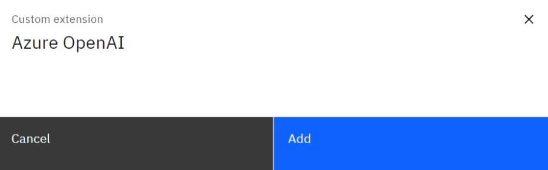
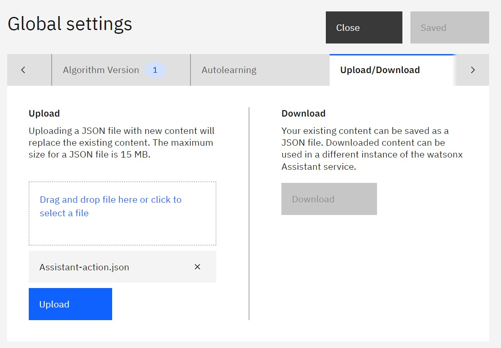
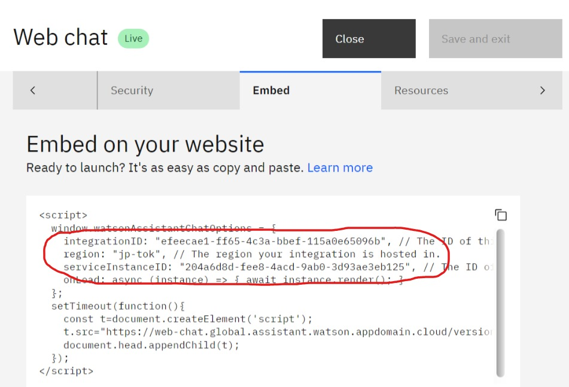

## 3. Develop watsonx Assistant

This is the part 3 of 4 hands-on guides:
1. [Introduction](readme.md#1-introduction)
2. [Provisioning IBM generative AI resources](provisioning.md#2-provisioning-ibm-generative-ai-resources)
3. [Develop watsonx Assistant](develop.md#3-develop-watsonx-assistant)
4. [Integrate IBM generative AI to your app](integrate.md#4-integrate-ibm-generative-ai-to-your-app)

Part (part 3) will guide you how to setup watsonx Assistant using pre-build sample

### 3.1. Setup Integration with Watson Discovery

1. Open your watsonx Assistant (if you haven't done so) by logging in to https://cloud.ibm.com and navigate to **Resource list** --> **AI / Machine Learning** --> **[your watsonx Assistant name]** --> **Launch watsonx Assistant**

    

     

    

     

    

2. Once your watsonx Assistant get opened, navigate to **Integrations** at the left side menu.

    

3. Scroll down little bit, under **Extensions** click **Build custom extension** button

    

4. On Custom extension, **Get Started** tab, click **Next** to move forward to Basic information tab.

    

5. On **Basic information** tab, fill the Extension name with **watson discovery** and then click **Next** button to move forward to Import OpenAPI tab

    

6. On **Import OpenAPI** tab, upload OpenAPI file of Watson Discovery that is located at **/assets/OpenAPI/watson-discovery-query-openapi.json** of the repo that you've cloned before and then click **Next** button to move forward to Review extension tab

    

7. On **Review extension** tab, click **Finish** button

    

8. Now, under **Extensions** you should see new tile available with the name **watson discovery**. Click **Add +** at the bottom right of the tile to add this extension into your watsonx Assistant **Draft environment**

    

9. Click **Add** button on the pop-up window and it will bring you to the extension authentication setting 

    

10. On the **Get started** tab, click **Next** button to move forward to the Authentication tab

    

11. On **Authentication** tab set the fields as follows:
    - Authentication type: **Basic auth**
    - Username: **apikey**
    - Password: [[**API Key** from step 7 of 1.2. Watson Discovery]](provisioning.md#12-watson-discovery)
    - discovery_url: [[**Url** from step 7 of 1.2. Watson Discovery]](provisioning.md#12-watson-discovery)

    

    Click **Next** button to move forward to **Review operation** tab

12. On **Review operations** tab, click **Finish** button to complete the integration setup with Watson Discovery for Draft environment

    

13. The step 8 to 12 are the setup for Draft environment, now we need to setup the same for Live environment. To do that, under **Extensions** you should see the tile with the name **watson discovery**, click **Open** at the bottom right of the tile to add this extension into your watsonx Assistant **Live environment**

    

14. On the pop-up window, change the Environment to **Live** and click **Confirm** button

    

15. Repeat the step 10 to 12 above to complete the integration setup with Watson Discovery for Live environment

16. Congratulation! you've completed setup integration with Watson Discovery

### 3.2. Setup Integration with watsonx.ai

1. Open your watsonx Assistant (if you haven't done so) by logging in to https://cloud.ibm.com and navigate to **Resource list** --> **AI / Machine Learning** --> **[your watsonx Assistant name]** --> **Launch watsonx Assistant**

    

    

    

2. Once your watsonx Assistant get opened, navigate to **Integrations** at the left side menu.

    

3. Scroll down little bit, under **Extensions** click **Build custom extension** button

    

4. On Custom extension, **Get Started** tab, click **Next** to move forward to Basic information tab.

    

5. On **Basic information** tab, fill the Extension name with **watsonx.ai** and then click **Next** button to move forward to Import OpenAPI tab

    

6. On **Import OpenAPI** tab, upload OpenAPI file of watsonx.ai that is located at **/assets/OpenAPI/watsonx-openapi.json** of the repo that you've cloned before and then click **Next** button to move forward to Review extension tab

    

7. On **Review extension** tab, click **Finish** button

    

8. Now, under **Extensions** you should see new tile available with the name **watsonx.ai**. Click **Add +** at the bottom right of the tile to add this extension into your watsonx Assistant **Draft environment**

    

9. Click **Add** button on the pop-up window and it will bring you to the extension authentication setting 

    

10. On the **Get started** tab, click **Next** button to move forward to the Authentication tab

    

11. On **Authentication** tab set the fields as follows:
    - Authentication type: **OAuth 2**
    - Grant type: **Custom apikey**
    - Apikey: **[ApiKey from 1.4. Create API key step 5]**
    - Leave the rest as is

    

    Click **Next** button to move forward to **Review operation** tab

12. On **Review operations** tab, click **Finish** button to complete the integration setup with watsonx.ai for Draft environment

    

13. The step 8 to 12 are the setup for Draft environment, now we need to setup the same for Live environment. To do that, under **Extensions** you should see the tile with the name **watsonx.ai**, click **Open** at the bottom right of the tile to add this extension into your watsonx Assistant **Live environment**

    

14. On the pop-up window, change the Environment to **Live** and click **Confirm** button

    

15. Repeat step 10 to 12 above to complete the integration setup with watsonx.ai for Live environment

16. Congratulation! you've completed setup integration with watsonx.ai

### 3.3. Setup Integration with Azure OpenAI

1. Open your watsonx Assistant (if you haven't done so) by logging in to https://cloud.ibm.com and navigate to **Resource list** --> **AI / Machine Learning** --> **[your watsonx Assistant name]** --> **Launch watsonx Assistant**

    

    

    

2. Once your watsonx Assistant get opened, navigate to **Integrations** at the left side menu.

    

3. Scroll down little bit, under **Extensions** click **Build custom extension** button

    

4. On Custom extension, **Get Started** tab, click **Next** to move forward to Basic information tab.

    

5. On **Basic information** tab, fill the Extension name with **Azure OpenAI** and then click **Next** button to move forward to Import OpenAPI tab

    

6. On **Import OpenAPI** tab, upload OpenAPI file of Azure OpenAI that is located at **/assets/OpenAPI/azure-openai-openapi.json** of the repo that you've cloned before and then click **Next** button to move forward to Review extension tab

    

7. On **Review extension** tab, click **Finish** button

    

8. Now, under **Extensions** you should see new tile available with the name **Azure OpenAI**. Click **Add +** at the bottom right of the tile to add this extension into your watsonx Assistant **Draft environment**

    

9. Click **Add** button on the pop-up window and it will bring you to the extension authentication setting 

    

10. On the **Get started** tab, click **Next** button to move forward to the Authentication tab

    

11. On **Authentication** tab set the fields as follows:
    - Authentication type: **API key auth**
    - Apikey: **[ask instructor]**
    - Server variable/endpoint: **[ask instructor]**

    

    Click **Next** button to move forward to **Review operation** tab

12. On **Review operations** tab, click **Finish** button to complete the integration setup with watsonx.ai for Draft environment

    

13. The step 8 to 12 are the setup for Draft environment, now we need to setup the same for Live environment. To do that, under **Extensions** you should see the tile with the name **Azure OpenAI**, click **Open** at the bottom right of the tile to add this extension into your watsonx Assistant **Live environment**

    

14. On the pop-up window, change the Environment to **Live** and click **Confirm** button

    

15. Repeat step 10 to 12 above to complete the integration setup with Azure OpenAI for Live environment

16. Congratulation! you've completed setup integration with Azure OpenAI

### 3.4. Upload pre-build watsonx Assistant

1. Open your watsonx Assistant (if you haven't done so) by logging in to https://cloud.ibm.com and navigate to **Resource list** --> **AI / Machine Learning** --> **[your watsonx Assistant name]** --> **Launch watsonx Assistant**

    

     

    

     

    

2. On Home page of watsonx Assistant click on **Go to settings** link

    

3. On the Global settings page, navigate to **Upload/Download** tab. Upload pre-buid watsonx Assistant file located at **assets/OpenAPI/assistant-action.json** of the repo that you've cloned before then click **Upload** button

    

4. Confirm the uplading by clicking **Upload and replace** button

    

5. Close Global settings by clicking **Close** button

    

6. Congratulation! you've completed setup pre-build watsonx Assistant

### 3.5. Get watsonx Assistant embed parameters

1. From left-side navigation click **Environments** menu

    

2. Click **Live** tab --> **Web chat** to open Web chat settings

    

3. Navigate to **Home screen** tab, and **trun off** Home screen

    

4. Navigate to **Embed** tab, take a note (copy and save) the following values:

    - IntegrationID
    - Region
    - ServiceInstanceID

    You will need them later

    

5. Close Web chat settings by clicking **Close** button

### 3.6. Publish watsonx Assistant

1. From left-side navigation click **Publish** menu

    

2. On Publish pege, click **Publish** button at the right side

    

3. Select **Live** environment and click on **Publish** button

    

4. Congratulation! you've just completed publishing watsonx Assistant

Next part [4. Integrate IBM generative AI to your app](integrate.md#4-integrate-ibm-generative-ai-to-your-app)