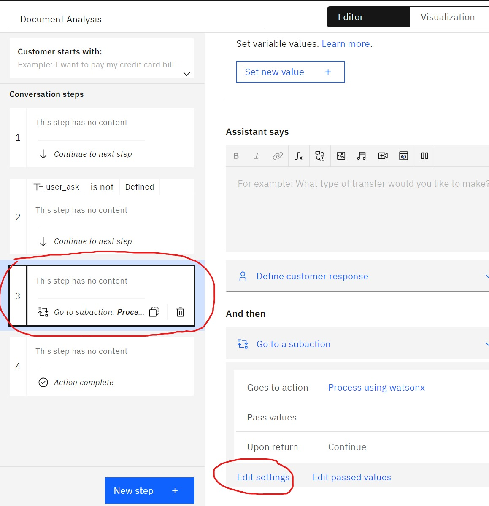

## 4. Integrate IBM generative AI to your app

This is the part 4 of 4 hands-on guides:
1. [Introduction](readme.md#1-introduction)
2. [Provisioning IBM generative AI resources](provisioning.md#2-provisioning-ibm-generative-ai-resources)
3. [Develop watsonx Assistant](develop.md#3-develop-watsonx-assistant)
4. [Integrate IBM generative AI to your app](integrate.md#4-integrate-ibm-generative-ai-to-your-app)

Part 4 will guide you how to use IBM generative AI in your app

### 3.1 Update application code

1. Use Visual Studio Code and open the source code you've cloned/downloaded before

2. Open Terminal on your Visual Studio Code and navigate to the following folder: \TalkToDoc\src\TalkToDoc

3. Run the following commands to add required parameters using user secrets:

    ```
    dotnet user-secrets init
    
    dotnet user-secrets set "watsonxAssistant:IntegrationId" "[your-integration-id]"

    dotnet user-secrets set "watsonxAssistant:Region" "jp-tok"

    dotnet user-secrets set "watsonxAssistant:ServiceInstanceID" "[your-service-instance-id]"

    dotnet user-secrets set "WatsonDiscovery:ApiKey" "[your-api-key]"

    dotnet user-secrets set "WatsonDiscovery:ApiVersion" "2023-03-31"

    dotnet user-secrets set "WatsonDiscovery:ApiUrl" "your-watson-discovery-url"

    dotnet user-secrets set "WatsonDiscovery:ProjectId" "your-watson-discovery-project-id"
    ```
    

### 3.2 Test your application

1. Debug sample app using the following command:

    ```
    dotnet restore

    dotnet run 
    ```

    


2. Use browser to open link that appear on the terminal e.g. http://localhost:5082

3. Try to upload sample document located on folder assets/samples/ 

    

4. Once you upload a document you will get the **document id** that you can use to start the chat. But you will need to wait for couple of minutes to allow Watson Discovery digest the data.

5. The default LLM mode is using **google/flan-ul2**

    

6. Now let try using different model e.g. Azure OpenAI (gpt-3.5-turbo)

7. Open watsonx Assistant, navigate to **Actions** --> **Created by you**

    

8. Open **Document Analysis** action, select step 3 and click on **Edit settings**

    

9. Change **Go to** value by selecting **Process using Azure OpenAI** and click **Apply** button

    

10. You can test watsonx Assistant directly inside watsonx Assistant webtool by clicking **Preview** button at the bottom right corner 

11. If required re-publish your watsonx Assistant on Live environment if you want to see the effect on your app.

12. Test again on sample app and see if any different

    

13. Congratulation, you've completed this workshop!
