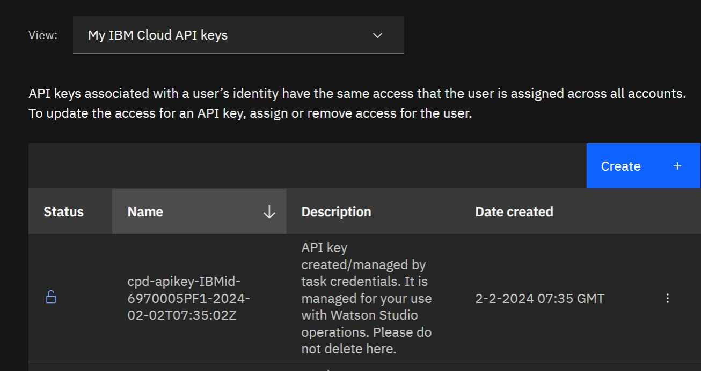

## 2. Provisioning IBM generative AI resources

This is the part 2 of 4 hands-on guides:
1. [Introduction](readme.md#1-introduction)
2. [Provisioning IBM generative AI resources](provisioning.md#2-provisioning-ibm-generative-ai-resources)
3. [Develop watsonx Assistant](develop.md#3-develop-watsonx-assistant)
4. [Integrate IBM generative AI to your app](integrate.md#4-integrate-ibm-generative-ai-to-your-app)

Part 2 will guide you how to provision all required IBM resources for this hands-on 

### 2.1. watsonx.ai

1. Login to https://cloud.ibm.com with your account
2. Click **Create resource** button at the right top corner
3. Type **Watson Machine Learning** into "Search the calatog..." textbox

    
    
    then it will show like this:

    

4. Select **Watson Machine Learning** as shown above, and then select a preferable location e.g. Tokyo(tj-tok) as shown below:

    

5. Under **Configure your resource** give the **Service name** as you prefer:

    

6. Mark (check) that you have read and agree the license agreement

    
    
    then click **Creat** button and wait for couple of minutes.

7. Click on **Launch in** --> **IBM watsonx** button
    
    

8. Select region/location your are using as you did on step-4 and login with your IBM Cloud Account by clicking **Continue** button

    

9. Create a new Project by clicking **+** button on the right side of the Projects tile

    

10. Give it the project name and click **Create** button

    

11. Get the Project ID by navigating to **Manage** tab. Take a note (copy and save) the Project ID, we will use it later.

    

12. Associate the Project with Watson Machine Learning you've just created in steps 2-6 by navigating to **Manage** tab --> **Service &amp; integrations**, and click **Associate service** button

    

13. Select Machine Learning you've just created in steps 2-6 by marking it (check) and click **Associate** button

    

14. Congratulation! now you've completed provision of watsonx.ai resource

### 2.2. Watson Discovery

1. Login to https://cloud.ibm.com with your account
2. Click **Create resource** button at the right top corner
3. Type **Watson Discovery** into "Search the calatog..." textbox

    
    
    then it will show like this:

    

4. Select **Watson Discovery** as shown above, and then select a preferable location e.g. Tokyo(tj-tok) as shown below:

    

5. Under **Configure your resource** give the **Service name** as you prefer:

    

6. Mark (check) that you have read and agree the license agreement

    
    
    then click **Creat** button and wait for couple of minutes.

7. Once Watson Discovery successfully created, take a note (copy and save) the **API key** and **URL** as we will need this later

    

8. Open Watson Discovery by clicking **Launch Watson Discovery** button
    
    

9. Create a new Project by clicking **New project** button.

    

10. Give it Project name, select **Document Retrieval** as for Project type and click **Next** button

    

11. Give it Collection name and leave English as selected language and then click **Finish** button

    

12. Get the Project ID by navigating to **Integrate and deploy** --> **API Information**. Take a note (copy and save) the Project ID as we will need this later

    

13. Congratulation! now you've completed provision of Watson Discovery resource

### 2.3. watsonx Assistant

1. Login to https://cloud.ibm.com with your account
2. Click **Create resource** button at the right top corner
3. Type **watsonx assistant** into "Search the calatog..." textbox

    
    
    then it will show like this:

    

4. Select **watsonx Assistant** as shown above, and then select a preferable location e.g. Tokyo(tj-tok) as shown below:

    

5. Under **Configure your resource** give the **Service name** as you prefer:

    

6. Mark (check) that you have read and agree the license agreement

    
    
    then click **Creat** button and wait for couple of minutes.

7. Open watsonx Assistant by clicking **Launch watsonx Assistant** button

    

8. Create your first assistant by following the screen wizard. Give it assistant a name, leave English as selected Assiatant language and click **Next** button

    

9. Personalize your assiatant by completing the wizard form and click **Next** button 

    

10. Click **Next** button once more and finally click **Create** button.

11. Congratulation! now you've completed provision of watsonx Assistant resource

### 2.4. Create API key

1. Login to https://cloud.ibm.com with your account
2. On the topbar menu navigate to **Manage** --> **Access (IAM)** --> **API keys**

    

    

3. On API keys list click on **Create** button

    

4. On the Create IBM Cloud API key form, give it a name and then click **Create** button

    

5. Copy and save somewhere your API key before you close the form. Once you close the form you'll not be able to see the key anymore.

    

6. Congratulation! now you've completed creating you API key

Next part [3. Develop watsonx Assistant](develop.md#3-develop-watsonx-assistant)