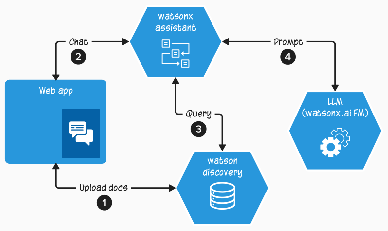
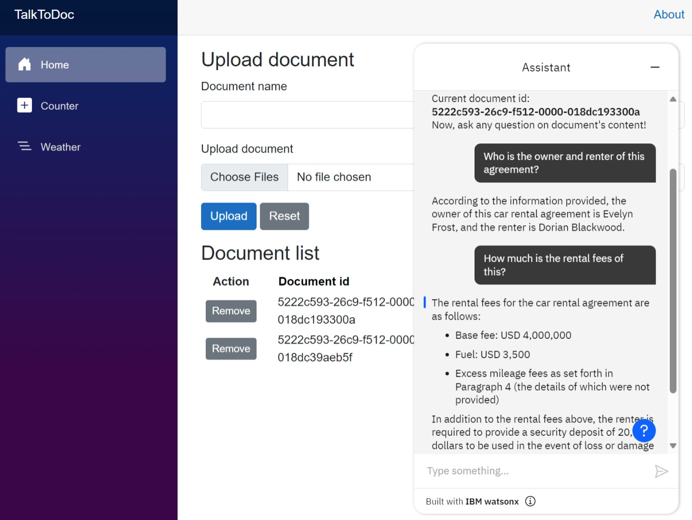

# Workshop: IBM Generative AI

## 1. Introduction
This workshop will guide you through step-by-step on how to adopt IBM generative AI service/product (watsonx Assistant, watsonx.ai and Watson Discovery) into your application with a simple use-case as starting point.

The sample app in this hands-on called **TalkToDoc** is a simple web application that enable user to chat with their document. This sample app was developed using .NET 

This sample app is powered by the following IBM generative AI service/product:

1. watsonx Assistant: https://www.ibm.com/products/watsonx-assistant
2. watsonx.ai: https://www.ibm.com/products/watsonx-ai
3. Watson Discovery: https://www.ibm.com/products/watson-discovery

**TalkToDoc architecture diagram**

1. User upload a document
2. User start chat with the document
3. watsonx Assistant query the docs
4. watsonx Assistant send prompt (containing doc query results) to LLM to generate the answer

**TalkToDoc App**

## Prerequisites
To be able to do this hans-on you will need to have the following:
1. IBM Cloud Account
2. Visual Studio Code: https://code.visualstudio.com/Download 
3. C# Dev Kit extension for VS Code: https://marketplace.visualstudio.com/items?itemName=ms-dotnettools.csdevkit
4. .NET SDK 8.0.2 - https://dotnet.microsoft.com/en-us/download/dotnet/8.0
5. Git Client: https://git-scm.com/
6. Clone/download this repo to your local machine: https://github.com/ronikurnia1/TalkToDoc.git 

## Hands-on Guide

This hands-on consists of 4 parts as follows:
1. [Introduction](readme.md#1-introduction)
2. [Provisioning IBM generative AI resources](provisioning.md#2-provisioning-ibm-generative-ai-resources)
3. [Develop watsonx Assistant](develop.md#3-develop-watsonx-assistant)
4. [Integrate IBM generative AI to your app](integrate.md#4-integrate-ibm-generative-ai-to-your-app)
