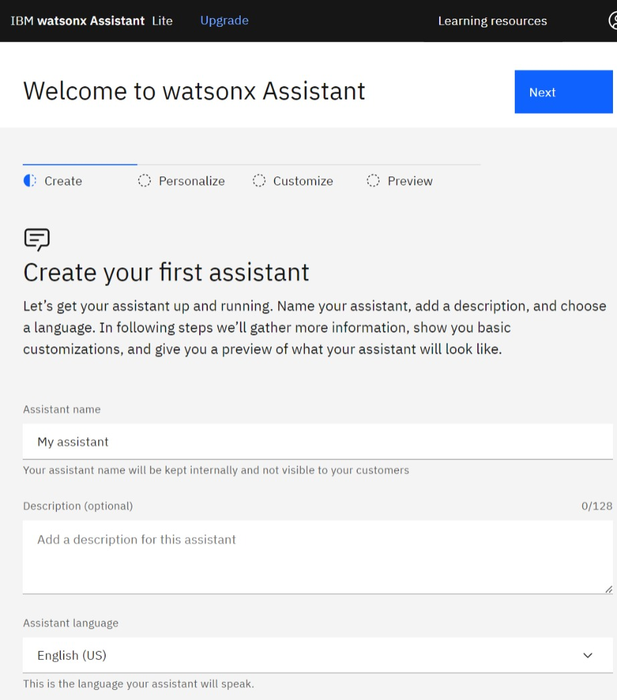
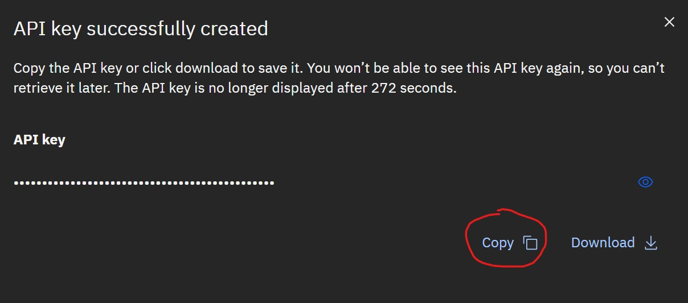
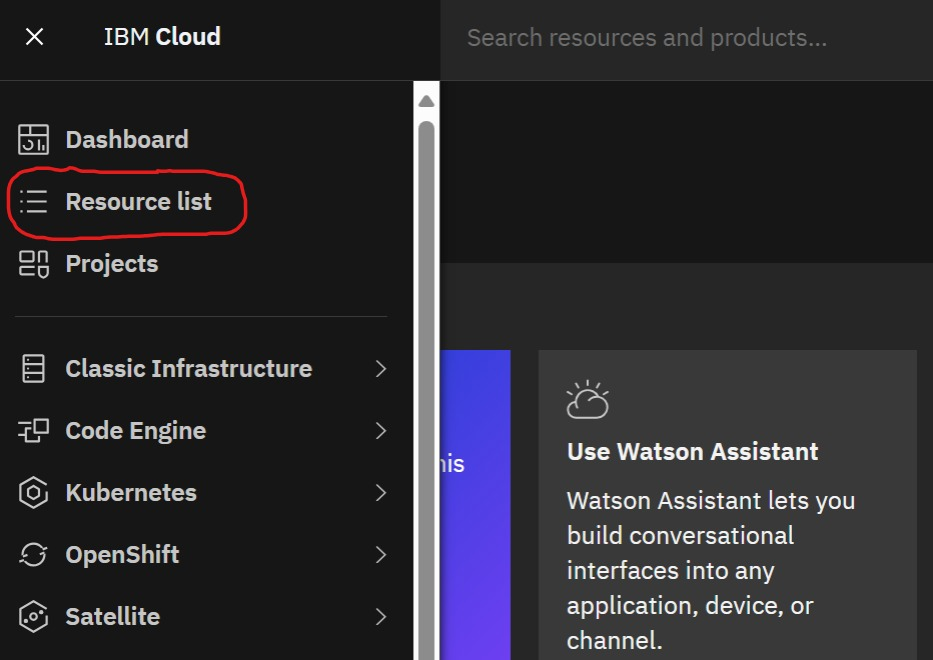
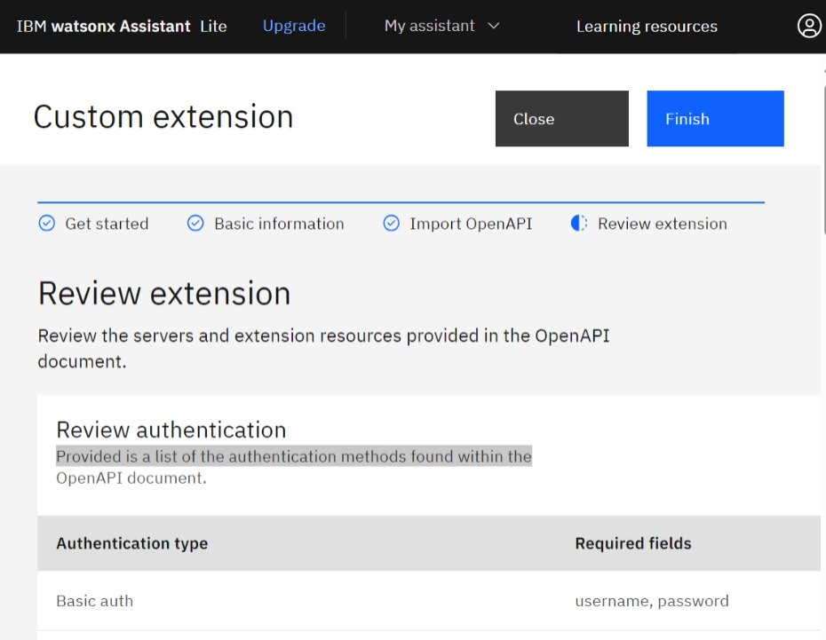
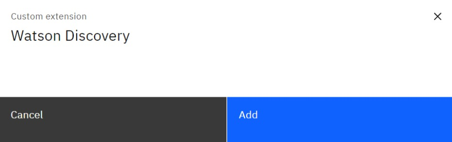
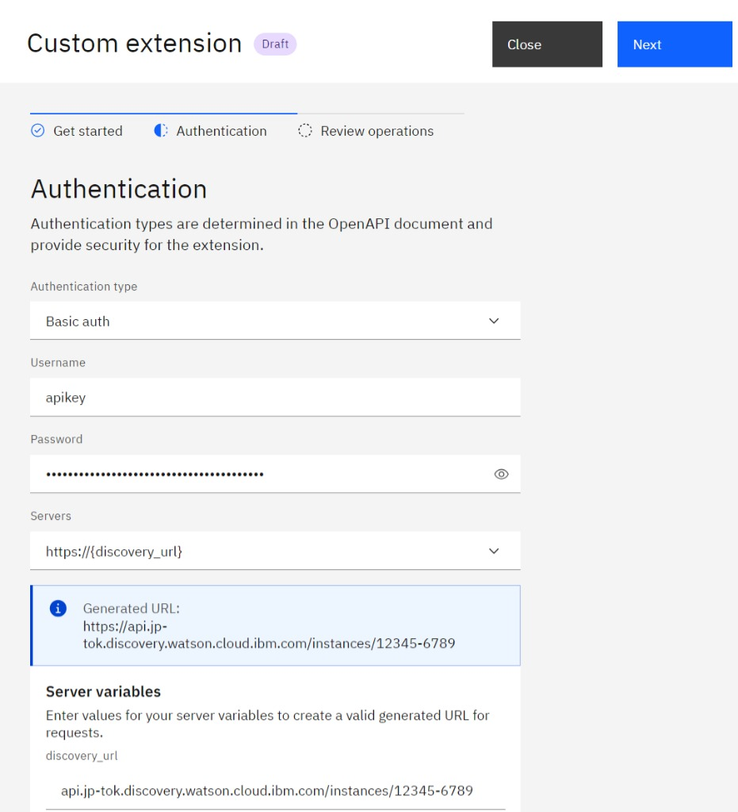
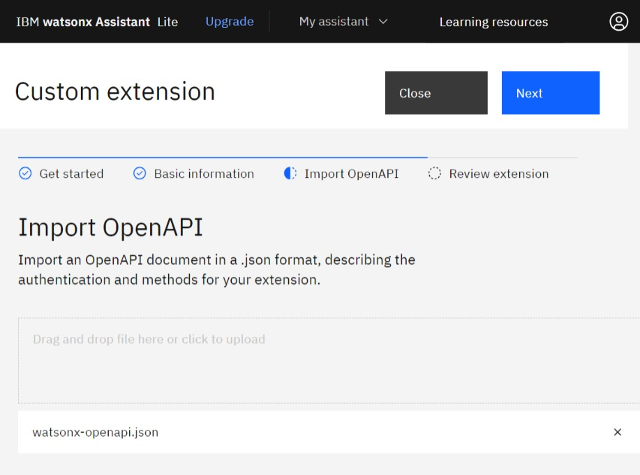
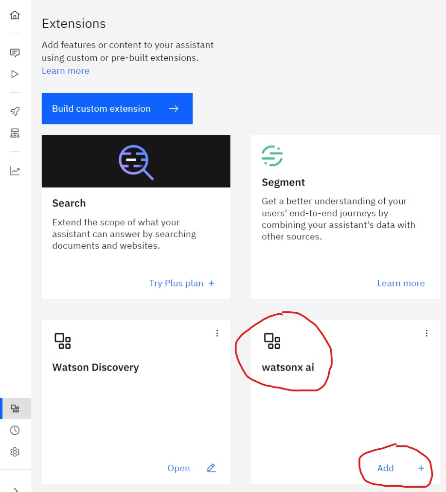
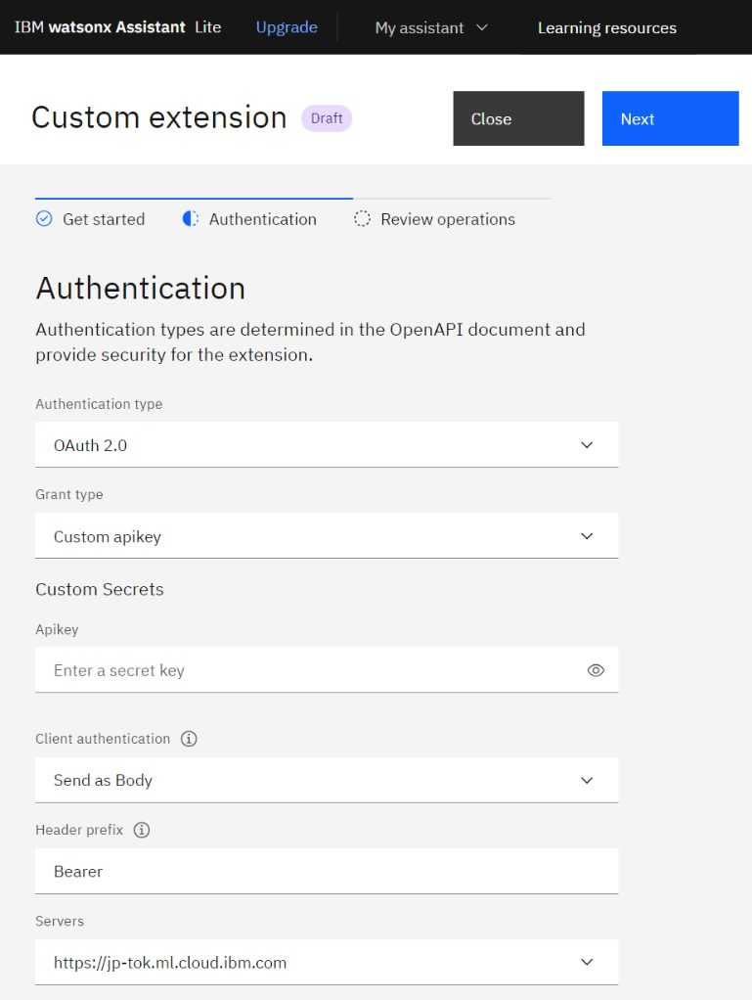
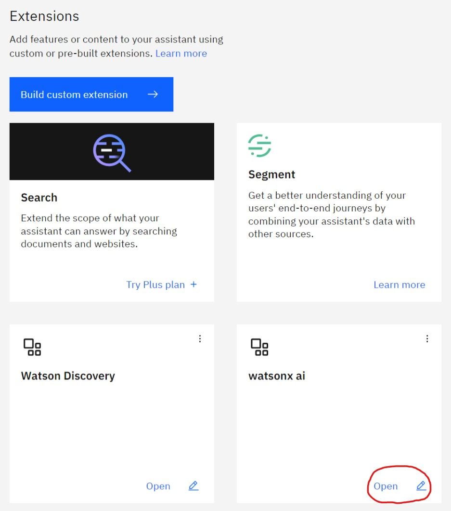

# Workshop: IBM Generative AI

## Overview
This hands-on will guide you through step-by-step on how to adopt IBM generative AI service/product (watsonx assistant, watsonx.ai and watson discovery) into your application with a simple use-case as starting point.

The sample app for this hands-on called TalkToDoc (ready to use) is a simple web application developed using .NET that enable user to chat with their document.

This sample app is powered by the following IBM generative AI service/product:

1. watsonx assistant: https://www.ibm.com/products/watsonx-assistant
2. watsonx.ai: https://www.ibm.com/products/watsonx-ai
3. watson discovery: https://www.ibm.com/products/watson-discovery

TalkToDoc architecture diagram:

1. User upload a document
2. User start chat with the document
3. watsonx assistant query the docs
4. watsonx assistant send prompt (containing doc query results) to LLM to generate the answer

## Prerequisites
To be able to do this hans-on you will need to have the following:
1. IBM Cloud Account
2. Visual Studio Code: https://code.visualstudio.com/Download 
3. C# Dev Kit extension for VS Code: https://marketplace.visualstudio.com/items?itemName=ms-dotnettools.csdevkit
4. .NET SDK 8.0.2 - https://dotnet.microsoft.com/en-us/download/dotnet/8.0
5. Git Client: https://git-scm.com/
6. Clone this repo to your local machine: https://github.com/ronikurnia1/TalkToDoc.git 

## Hands-on Guide

This hands-on consists of 3 parts of as follow:
1. Provisioning IBM generative AI resources
2. Develop watsonx Assistant
3. Use IBM generative AI in your app

## 1. Provisioning IBM generative AI resources

This first part will guide you to provision all required IBM resources for this hands-on 

### 1.1. watsonx.ai

1. Login to https://cloud.ibm.com with your account
2. Click **Create resource** button at the right top corner
3. Type **Watson Machine Learning** into "Search the calatog..." textbox

    
    
    then it will show like this:

    

4. Select **Watson Machine Learning** as shown above, and then select a preferable location e.g. Tokyo(tj-tok) as shown below:

    

5. Under **Configure your resource** give the **Service name** as you prefer:

    

6. Mark (check) that you have read and agree the license agreement

    
    
    then click **Creat** button and wait for couple of minutes.

7. Click on **Launch in** --> **IBM watsonx** button
    
    

8. Select region/location your are using as you did on step-4 and login with your IBM Cloud Account by clicking **Continue** button

    

9. Create a new Project by clicking **+** button on the right side of the Projects tile

    

10. Give it the project name and click **Create** button

    

11. Get the Project ID by navigating to **Manage** tab. Take a note (copy and save) the Project ID, we will use it later.

    

12. Associate the Project with Watson Machine Learning you've just created in steps 2-6 by navigating to **Manage** tab --> **Service &amp; integrations**, and click **Associate service** button

    

13. Select Machine Learning you've just created in steps 2-6 by marking it (check) and click **Associate** button

    

14. Congratulation! now you've completed provision of watsonx.ai resource

### 1.2. Watson Discovery

1. Login to https://cloud.ibm.com with your account
2. Click **Create resource** button at the right top corner
3. Type **Watson Discovery** into "Search the calatog..." textbox

    
    
    then it will show like this:

    

4. Select **Watson Discovery** as shown above, and then select a preferable location e.g. Tokyo(tj-tok) as shown below:

    

5. Under **Configure your resource** give the **Service name** as you prefer:

    

6. Mark (check) that you have read and agree the license agreement

    
    
    then click **Creat** button and wait for couple of minutes.

7. Once Watson Discovery successfully created, take a note (copy and save) the **API key** and **URL** as we will need this later

    

8. Open Watson Discovery by clicking **Launch Watson Discovery** button
    
    

9. Create a new Project by clicking **New project** button.

    

10. Give it Project name, select **Document Retrieval** as for Project type and click **Next** button

    

11. Give it Collection name and leave English as selected language and then click **Finish** button

    

12. Get the Project ID by navigating to **Integrate and deploy** --> **API Information**. Take a note (copy and save) the Project ID as we will need this later

    

13. Congratulation! now you've completed provision of Watson Discovery resource

### 1.3. watsonx assistant

1. Login to https://cloud.ibm.com with your account
2. Click **Create resource** button at the right top corner
3. Type **watsonx assistant** into "Search the calatog..." textbox

    
    
    then it will show like this:

    

4. Select **watsonx Assistant** as shown above, and then select a preferable location e.g. Tokyo(tj-tok) as shown below:

    

5. Under **Configure your resource** give the **Service name** as you prefer:

    

6. Mark (check) that you have read and agree the license agreement

    
    
    then click **Creat** button and wait for couple of minutes.

7. Open watsonx Assistant by clicking **Launch watsonx Assistant** button

    

8. Create your first assistant by following the screen wizard. Give it assistant a name, leave English as selected Assiatant language and click **Next** button

    

9. Personalize your assiatant by completing the wizard form and click **Next** button 

    

10. Click **Next** button once more and finally click **Create** button.

11. Congratulation! now you've completed provision of watsonx Assistant resource

### 1.4. Create API key

1. Login to https://cloud.ibm.com with your account
2. On the topbar menu navigate to **Manage** --> **Access (IAM)** --> **API keys**

    
    
    

3. On API keys list click on **Create** button

    

4. On the Create IBM Cloud API key form, give it a name and then click **Create** button

    

5. Copy and save somewhere your API key before you close the form. Once you close the form you'll not be able to see the key anymore.

    

6. Done, you've created you API key

## 2. Develop watsonx Assistant

This second part will guide you how to setup watsonx Assistant using pre-develop sample

### 2.1. Setup Integration with Watson Discovery

1. Open your watsonx Assistant (if you haven't done so) by logging in to https://cloud.ibm.com and navigate to **Resource list** --> **AI / Machine Learning** --> **[your watsonx Assistant name]** --> **Launch watsonx Assistant**

    

    

    

2. Once your watsonx Assistant get opened, navigate to **Integrations** at the left side menu.

    

3. Scroll down little bit, under **Extensions** click **Build custom extension** button

    

4. On Custom extension, **Get Started** tab, click **Next** to move forward to Basic information tab.

    

5. On **Basic information** tab, give it Extension name e.g. *Watson Discovery* and then click **Next** button to move forward to Import OpenAPI tab

    

6. On **Import OpenAPI** tab, upload OpenAPI file of Watson Discovery that is located at **/assets/OpenAPI/watson-discovery-query-openapi.json** of the repo that you've cloned before and then click **Next** button to move forward to Review extension tab

    

7. On **Review extension** tab, click **Finish** button

    

8. Now, under **Extensions** you should see new tile available with the name you gave on step 5 e.g. *Watson Discovery*. Click **Add +** at the bottom right of the tile to add this extension into your watsonx Assistant **Draft environment**

    

9. Click **Add** button on the pop-up window and it will bring you to the extension authentication setting 

    

10. On the **Get started** tab, click **Next** button to move forward to the Authentication tab

    

11. On **Authentication** tab set the fields as follows:
    - Authentication type: **Basic auth**
    - Username: **apikey**
    - Password: **[ApiKey from 1.2. Watson Discovery step 7]**
    - discovery_url: **[Url from 1.2. Watson Discovery step 7]**

    

    Click **Next** button to move forward to **Review operation** tab

12. On **Review operations** tab, click **Finish** button to complete the integration setup with Watson Discovery for Draft environment

13. The step 8 to 12 are the setup for Draft environment, now we need to setup the same for Live environment. To do that, under **Extensions** you should see the tile with the name you gave on step 5 e.g. *Watson Discovery*, click **Open** at the bottom right of the tile to add this extension into your watsonx Assistant **Live environment**

    

14. On the pop-up window, change the Environment to **Live** and click **Confirm** button

    

15. Repeat the step 10 to 12 above to complete the integration setup with Watson Discovery for Live environment

16. Congratulation! you've completed setup integration with Watson Discovery

### 2.2. Setup Integration with watsonx.ai

1. Open your watsonx Assistant (if you haven't done so) by logging in to https://cloud.ibm.com and navigate to **Resource list** --> **AI / Machine Learning** --> **[your watsonx Assistant name]** --> **Launch watsonx Assistant**

    

    

    

2. Once your watsonx Assistant get opened, navigate to **Integrations** at the left side menu.

    

3. Scroll down little bit, under **Extensions** click **Build custom extension** button

    

4. On Custom extension, **Get Started** tab, click **Next** to move forward to Basic information tab.

    

5. On **Basic information** tab, give it Extension name e.g. *watsonx ai* and then click **Next** button to move forward to Import OpenAPI tab

    

6. On **Import OpenAPI** tab, upload OpenAPI file of watsonx.ai that is located at **/assets/OpenAPI/watsonx-openapi.json** of the repo that you've cloned before and then click **Next** button to move forward to Review extension tab

    

7. On **Review extension** tab, click **Finish** button

    

8. Now, under **Extensions** you should see new tile available with the name you gave on step 5 e.g. *watsonx ai*. Click **Add +** at the bottom right of the tile to add this extension into your watsonx Assistant **Draft environment**

    

9. Click **Add** button on the pop-up window and it will bring you to the extension authentication setting 

    

10. On the **Get started** tab, click **Next** button to move forward to the Authentication tab

    

11. On **Authentication** tab set the fields as follows:
    - Authentication type: **OAuth 2**
    - Grant type: **Custom apikey**
    - Apikey: **[ApiKey from 1.4. Create API key step 5]**
    - Leave the rest as is

    

    Click **Next** button to move forward to **Review operation** tab

12. On **Review operations** tab, click **Finish** button to complete the integration setup with watsonx.ai for Draft environment

13. The step 8 to 12 are the setup for Draft environment, now we need to setup the same for Live environment. To do that, under **Extensions** you should see the tile with the name you gave on step 5 e.g. *Watson ai*, click **Open** at the bottom right of the tile to add this extension into your watsonx Assistant **Live environment**

    

14. On the pop-up window, change the Environment to **Live** and click **Confirm** button

    

15. Repeat the step 10 to 12 above to complete the integration setup with watsonx.ai for Live environment

16. Congratulation! you've completed setup integration with watsonx.ai

### 2.3. Upload pre-build watsonx Assistant

1. Open watsonx Assistant 

## 3. Use IBM generative AI in your app

This third part will guide you how to use IBM generative AI in your app

### 3.1 Update application code

### 3.2 Test your application

